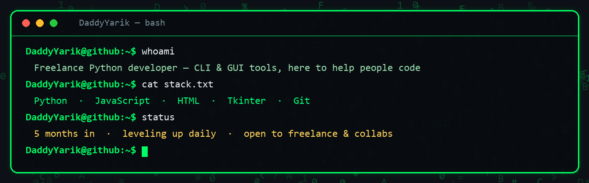

<!-- ░░░ DaddyYarik · GitHub profile ░░░ -->

  

  

  

---

### 👋 About me

- 🐍 **Freelance developer** working mainly with **Python**, plus **JavaScript** & **HTML**
- 🛠️ I build small, fun and useful things — command-line tools and desktop GUIs
- 🌱 ~5 months into the craft and **leveling up every single day**
- 🤝 I genuinely enjoy **helping people get into coding** — always open to collaborate
- 💬 Ask me about Python scripting, building your first CLI, or Tkinter desktop apps

### 🧰 Tech &amp; Tools

  
  
  
  
  
  
  
  
  
  
  

### 📌 Featured projects

  
  

  
  

  

  
  

> 🧩 **gitvibe** — your Git history, *Wrapped*-style · 👻 **PhantomBreach** — Hollywood-style hacking prank · 🟢 **HackerPanel** — cyberpunk joke panel · 🛰 **CipherBot** — Telegram cyber-toolkit · 🖥 **NeoDeck** — self-hostable cyberpunk dashboard (Svelte)

### 📊 GitHub in numbers

  
  

  

### 🤝 Let's connect

  
  

---

  ⭐ <i>"Want to help people in coding."</i> — let's build something fun together.

